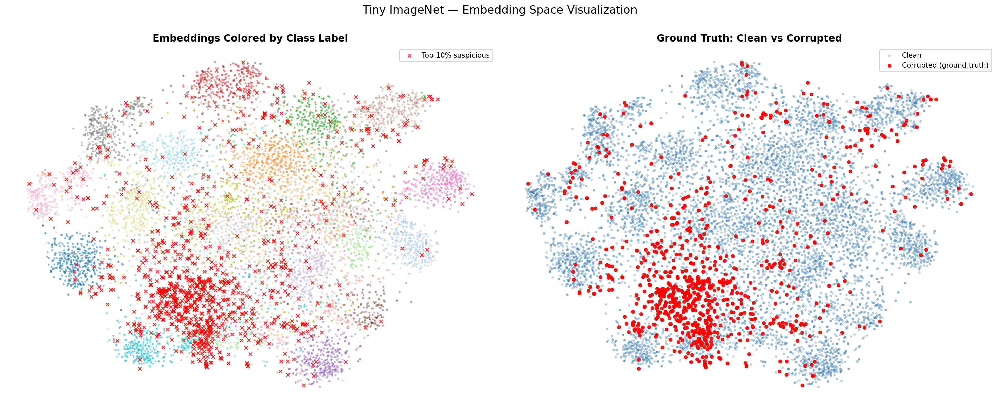
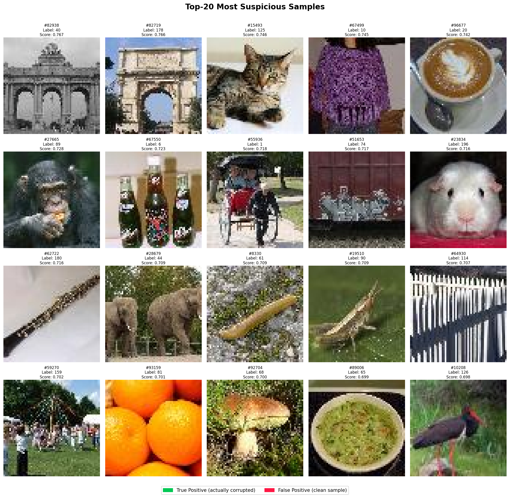
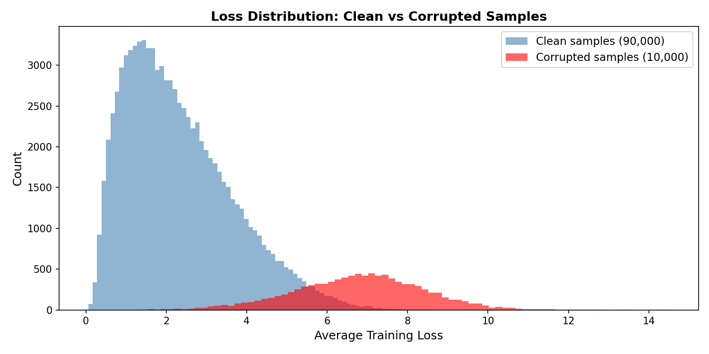
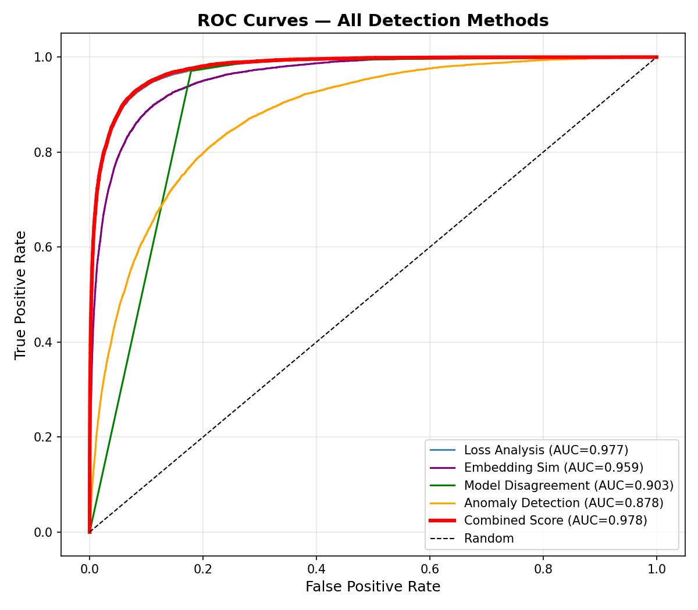
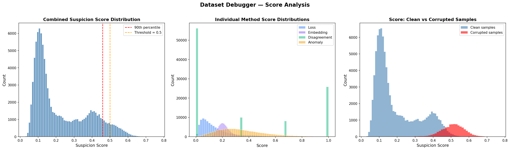
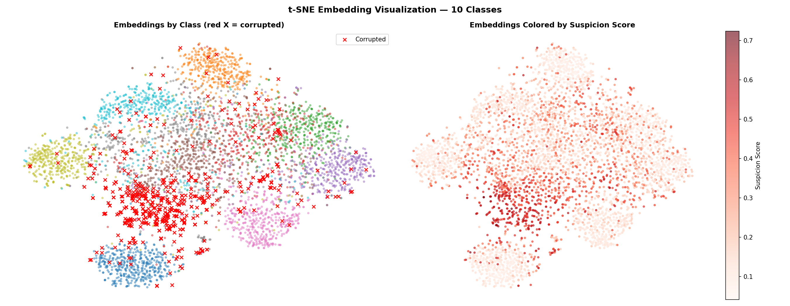

# Dataset Debugger

> **Automated detection of mislabeled, suspicious, and anomalous samples in large-scale image datasets using four complementary detection methods.**

<p align="center">
  
</p>

---

## Table of Contents

- [Overview](#overview)
- [Key Results](#key-results)
- [How It Works](#how-it-works)
- [Project Structure](#project-structure)
- [Installation](#installation)
- [Usage](#usage)
- [Detection Methods](#detection-methods)
- [Results & Visualizations](#results--visualizations)
- [Configuration](#configuration)
- [Notebooks](#notebooks)
- [Tests](#tests)
- [Reproducing on Kaggle](#reproducing-on-kaggle)

---

## Overview

Real-world datasets collected through crowdsourcing, web scraping, or automated annotation pipelines inevitably contain label errors. These errors propagate silently through training, degrading model performance in ways that are hard to diagnose.

**Dataset Debugger** takes a data-centric approach: instead of improving the model, it improves the dataset. It trains three ResNet-18 models on a corrupted version of Tiny ImageNet, then uses the models' behavior to automatically identify which samples are likely mislabeled.

**The core insight:** mislabeled samples receive contradictory gradient signals throughout training, resulting in persistently higher loss, geometric misplacement in embedding space, and consistent model disagreement — all measurable signals.

---

## Key Results

Evaluated on **Tiny ImageNet** (200 classes, 100,000 samples) with **10% synthetic label corruption** (10,000 flipped labels):

| Metric | Value |
|--------|-------|
| **AUROC** | **0.9780** |
| **Precision** | 0.9265 |
| **Recall** | 0.5782 |
| **F1 Score** | 0.7120 |
| **Avg Precision (AP)** | 0.8742 |
| **Precision@100** | **1.0000** |
| **Precision@500** | 0.9980 |
| **Precision@1000** | 0.9980 |
| **Precision@2000** | 0.9875 |
| **Precision@5000** | 0.9522 |

> **Practical finding:** Reviewing just **15% of the dataset** (15,000 samples) recovers **90% of all corrupted labels** — an 85% reduction in manual review effort.

<p align="center">
  
</p>

*Top-20 most suspicious samples — all 20 are True Positives (green border). Precision@100 = 1.000.*

---

## How It Works

```
Dataset (100k samples, 10% corrupted labels)
         │
         ▼
┌─────────────────────┐
│  Train 3× ResNet-18 │  (different seeds for ensemble diversity)
│  Per-sample loss    │  (tracked every epoch via LossTracker)
└─────────┬───────────┘
          │
          ▼
┌──────────────────────────────────────────────────┐
│               4 Detection Methods                │
│                                                  │
│  1. Loss Analysis      (weight: 40%)             │
│     Corrupted samples: 4.7× higher avg loss      │
│                                                  │
│  2. Embedding Similarity (weight: 30%)           │
│     Cosine sim to class cluster in feature space │
│                                                  │
│  3. Model Disagreement (weight: 20%)             │
│     3 models independently vote against label    │
│                                                  │
│  4. Anomaly Detection  (weight: 10%)             │
│     Isolation Forest on 512-dim embeddings       │
└──────────────────┬───────────────────────────────┘
                   │
                   ▼
        Combined Suspicion Score
        s(i) = 0.40·loss + 0.30·embed + 0.20·disagree + 0.10·anomaly
                   │
                   ▼
        Ranked list of suspicious samples
        → Precision@100: 1.000  |  AUROC: 0.978
```

---

## Project Structure

```
dataset-debugger/
│
├── data/
│   ├── __init__.py
│   ├── download.py              # Download & extract Tiny ImageNet
│   ├── dataset.py               # PyTorch Dataset class, DataLoader factory
│   ├── transforms.py            # Normalization, augmentation pipelines
│   └── corrupt.py               # Label flipping + corruption_index.json
│
├── models/
│   ├── __init__.py
│   └── resnet.py                # ResNet-18 adapted for 64×64 input
│
├── training/
│   ├── __init__.py
│   ├── trainer.py               # Training loop with per-sample loss tracking
│   ├── loss_tracker.py          # Records per-sample loss every epoch
│   └── callbacks.py             # Early stopping, checkpointing
│
├── detection/
│   ├── __init__.py
│   ├── model_disagreement.py    # Method 1 — ensemble vote vs label
│   ├── embedding_similarity.py  # Method 2 — cosine sim in feature space
│   ├── anomaly_detection.py     # Method 3 — Isolation Forest on embeddings
│   ├── loss_analysis.py         # Method 4 — persistent high-loss detection
│   └── suspicion_score.py       # Weighted combination of all 4 signals
│
├── evaluation/
│   ├── __init__.py
│   └── metrics.py               # Precision, recall, F1, AUROC vs ground truth
│
├── visualization/
│   ├── __init__.py
│   ├── tsne_plot.py             # t-SNE / UMAP embedding visualization
│   ├── sample_gallery.py        # Top-N suspicious sample image grid
│   └── score_distribution.py   # Suspicion score histograms
│
├── configs/
│   ├── base_config.yaml         # Paths, seeds, model hyperparameters
│   └── debugger_config.yaml     # Suspicion weights, thresholds, top-K
│
├── notebooks/
│   ├── 01_data_and_corruption.ipynb
│   ├── 02_baseline_training.ipynb
│   ├── 03_detection_methods.ipynb
│   ├── 04_combined_score.ipynb
│   └── 05_visualization.ipynb
│
├── outputs/
│   ├── checkpoints/             # Model weights (.pth) + loss trackers (.npy)
│   ├── scores/                  # Per-method and combined scores (.npy)
│   ├── figures/                 # All generated plots (.png)
│   └── reports/                 # metrics.json, debugger_report.json
│
├── tests/
│   ├── test_corrupt.py          # Unit tests for corruption logic
│   ├── test_detection.py        # Unit tests for detection methods
│   └── test_suspicion.py        # Unit tests for suspicion scorer
│
├── main.py                      # End-to-end pipeline runner
├── conftest.py                  # Pytest path fix — adds project root to sys.path
├── requirements.txt
└── README.md
```

---

## Installation

**Requirements:** Python 3.9+, PyTorch 2.0+

```bash
# 1. Clone the repository
git clone https://github.com/ramizallahverdiyev/dataset-debugger.git
cd dataset-debugger

# 2. Create virtual environment
python -m venv .venv
source .venv/bin/activate  # Windows: .venv\Scripts\activate

# 3. Install dependencies
pip install -r requirements.txt

# 4. Install UMAP (requires conda due to llvmlite build issue on Python 3.12)
conda install -c conda-forge umap-learn
# OR on Python 3.11:
pip install umap-learn
```

---

## Usage

### Full Pipeline

```bash
python main.py
```

### Stage by Stage

```bash
# Stage 1 & 2: Download Tiny ImageNet + inject 10% label corruption
python main.py --stage prepare

# Stage 3: Train 3 ResNet-18 models with per-sample loss tracking
python main.py --stage train

# Stage 4-6: Run all detection methods + compute suspicion scores + evaluate
python main.py --stage detect

# Stage 7: Generate t-SNE plot, suspicious gallery, score histograms
python main.py --stage visualize
```

### Custom Config

```bash
python main.py --base-config configs/base_config.yaml \
               --debugger-config configs/debugger_config.yaml
```

---

## Detection Methods

### Method 1 — Training Loss Analysis (weight: 40%)

Mislabeled samples create an irreconcilable conflict during training — the gradient pushes toward an incorrect class, resulting in persistently high loss across all epochs.

**Key finding:** Corrupted samples have **4.7× higher** average training loss than clean samples (mean: 7.12 vs 1.51).

<p align="center">
  
</p>

### Method 2 — Embedding Similarity (weight: 30%)

The penultimate layer of ResNet-18 produces 512-dimensional feature embeddings. A mislabeled sample is geometrically positioned near its true class cluster, not its assigned class cluster.

For each sample, the suspicion score is `1 - avg_cosine_similarity_to_top_50_class_neighbors`.

### Method 3 — Model Disagreement (weight: 20%)

Three independently trained models (seeds 42, 43, 44) vote on each sample. If all three disagree with the dataset label, the sample is likely mislabeled.

```
Sample #128  Dataset label: cat
  Model A → dog  ✗
  Model B → dog  ✗
  Model C → dog  ✗
  disagreement_score = 3/3 = 1.0  →  Very suspicious
```

### Method 4 — Anomaly Detection (weight: 10%)

Isolation Forest applied per-class to the 512-dim embedding matrix. Catches statistically unusual samples — a different class of problem from simple mislabeling.

### Combined Suspicion Score

```
s(i) = 0.40 × s_loss(i)
     + 0.30 × s_embed(i)
     + 0.20 × s_disagree(i)
     + 0.10 × s_anomaly(i)
```

All scores normalized to [0, 1] before combination.

---

## Results & Visualizations

### Methods Comparison

| Method | Precision | Recall | F1 | AUROC |
|--------|-----------|--------|-----|-------|
| Loss Analysis | 0.9926 | 0.1341 | 0.2363 | 0.9767 |
| Embedding Sim | 0.7500 | 0.0003 | 0.0006 | 0.9586 |
| Model Disagreement | 0.2909 | 0.9877 | 0.4495 | 0.9034 |
| Anomaly Detection | 0.3796 | 0.6825 | 0.4879 | 0.8776 |
| **Combined Score** | **0.9265** | **0.5782** | **0.7120** | **0.9780** |

Each method has a complementary strength — combining them yields the best overall performance.

### ROC Curves

<p align="center">
  
</p>

### Score Distributions

<p align="center">
  
</p>

### Embedding Space (t-SNE)

<p align="center">
  
</p>

*Corrupted samples (red ×) appear between class clusters — positioned near their true class, not their assigned class.*

---

## Configuration

### `configs/base_config.yaml`

```yaml
data:
  raw_dir:        "data/raw"
  corrupted_dir:  "data/corrupted"
  dataset_root:   "data/raw/tiny-imagenet-200"
  num_classes:    200
  num_workers:    4

training:
  batch_size:     128
  epochs:         30
  lr:             0.1
  momentum:       0.9
  weight_decay:   1.0e-4
  patience:       7
  seed:           42

model:
  num_models:     3    # For model disagreement method

outputs:
  checkpoints:    "outputs/checkpoints"
  scores:         "outputs/scores"
  figures:        "outputs/figures"
  reports:        "outputs/reports"
```

### `configs/debugger_config.yaml`

```yaml
corruption:
  rate:           0.10    # 10% of labels flipped
  seed:           42

suspicion_weights:
  loss:           0.40
  embedding:      0.30
  disagreement:   0.20
  anomaly:        0.10

detection:
  threshold:      0.50
  top_k:          500
  embedding_top_k: 50

anomaly:
  contamination:  0.10
  n_estimators:   200
  per_class:      true
```

---

## Notebooks

Five analysis notebooks walk through the full experiment:

| Notebook | Description |
|----------|-------------|
| `01_data_and_corruption.ipynb` | Dataset exploration, class distribution, corruption injection |
| `02_baseline_training.ipynb` | Model architecture, loss distributions, clean vs corrupted loss |
| `03_detection_methods.ipynb` | Each method individually with Precision@K analysis |
| `04_combined_score.ipynb` | ROC curves, PR curves, methods comparison, correlation matrix |
| `05_visualization.ipynb` | t-SNE plots, suspicious gallery, efficiency analysis |

```bash
pip install jupyter
jupyter notebook
```

---

## Tests

20/20 tests passing.

```bash
# Run all tests
pytest tests/ -v

# Run specific test file
pytest tests/test_corrupt.py -v
pytest tests/test_detection.py -v
pytest tests/test_suspicion.py -v
```

Tests cover:
- Corruption rate accuracy and reproducibility
- Loss analysis score range and high-loss detection
- Anomaly detection on injected outliers
- Suspicion scorer weight validation and ranking

> **Note:** `conftest.py` in the project root adds the project directory to `sys.path` so pytest can resolve module imports correctly.

---

## Reproducing on Kaggle

Training requires a GPU. The recommended workflow:

**1. Train on Kaggle (free P100 GPU):**
```python
# In a Kaggle notebook
!git clone https://github.com/ramizallahverdiyev/dataset-debugger.git
%cd dataset-debugger
!pip install umap-learn pyyaml -q

# Add Tiny ImageNet dataset: nikhilshingadiya/tinyimagenet200
# Update base_config.yaml with Kaggle paths, then:
!python main.py --stage prepare
!python main.py --stage train
```

**2. Download checkpoints from Kaggle Output tab**

**3. Continue locally (CPU sufficient):**
```bash
# Drop downloaded files into project:
# outputs/checkpoints/  ← model_A_best.pth, model_B_best.pth, model_C_best.pth
# outputs/checkpoints/  ← model_A_loss_tracker.npy (×3)
# data/corrupted/       ← corruption_index.json, corruption_map.json

python main.py --stage detect
python main.py --stage visualize
```

---

## Author

**Ramiz Allahverdiyev** — March 2026